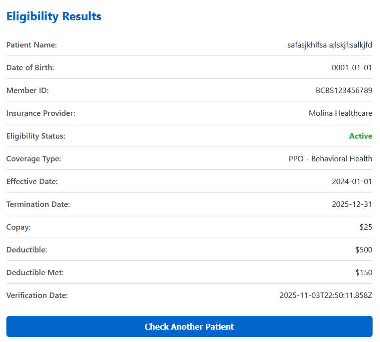
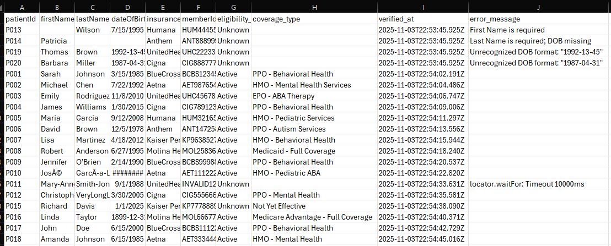

# BlueSprig Insurance Eligibility Automation

Automates the verification of patient insurance eligibility from a CSV file through a mock web portal using **Playwright** and **Node.js**.

---

## Table of Contents

1. [Overview](#overview)
2. [Setup Instructions](#setup-instructions)
3. [Running the Script](#running-the-script)
4. [Running Tests](#running-tests)
5. [Design Decisions & Tradeoffs](#design-decisions--tradeoffs)
6. [Known Issues](#known-issues)
7. [Screenshot of Portal Bug](#screenshot-of-portal-bug)
8. [Project Structure](#project-structure)
9. [Example Output](#example-output)
10. [License](#license)

---

## Overview

This project simulates BlueSprig’s daily insurance verification workflow:

- Reads patient data from a CSV file.
- Logs into the mock insurance portal.
- Automates eligibility lookups using Playwright.
- Writes structured eligibility results to an output CSV file.
- Includes full test coverage: unit, integration, and end-to-end (E2E) tests.

---

## Setup Instructions

### Prerequisites

- **Node.js** v20+  
- **npm** v10+  
- A `.env` file containing mock portal credentials

### Installation

```bash
git clone https://github.com/wards22/automation_engineer_takehome.git
cd automation_engineer_takehome
npm install
cp .env.example .env
# Fill in .env with your mock portal credentials
```

Example `.env` file:
```env
# Portal Configuration
PORTAL_BASE_URL=https://bluesprig-pediatrics.github.io/automation_engineer_takehome/mock-portal/
PORTAL_USERNAME=test_user
PORTAL_PASSWORD=test_pass123
PW_ACTION_TIMEOUT=10000

# Input/Output Paths
INPUT_CSV_PATH=./data/patients_sample.csv
OUTPUT_CSV_PATH=./output/eligibility_results.csv

# Browser Configuration
HEADLESS=true
TIMEOUT_MS=30000

# Logging
LOG_LEVEL=info

# Demo Patient Data (for manual testing with demo script)
DEMO_PATIENT_ID=P-DEMO
DEMO_PATIENT_FIRST_NAME=
DEMO_PATIENT_LAST_NAME=
DEMO_PATIENT_DOB=YYYY-MM-DD
DEMO_PATIENT_INSURANCE=
DEMO_PATIENT_MEMBER_ID=

# Test Patient Data (for integration tests)
TEST_PATIENT_FIRST_NAME=
TEST_PATIENT_LAST_NAME=
TEST_PATIENT_DOB=YYYY-MM-DD
TEST_PATIENT_INSURANCE=
TEST_PATIENT_MEMBER_ID=

TEST_PATIENT2_FIRST_NAME=
TEST_PATIENT2_LAST_NAME=
TEST_PATIENT2_DOB=YYYY-MM-DD
TEST_PATIENT2_INSURANCE=
TEST_PATIENT2_MEMBER_ID=

# E2E Test Patient Data
E2E_PATIENT1_ID=
E2E_PATIENT1_FIRST_NAME=
E2E_PATIENT1_LAST_NAME=
E2E_PATIENT1_DOB=YYYY-MM-DD
E2E_PATIENT1_INSURANCE=
E2E_PATIENT1_MEMBER_ID=

E2E_PATIENT2_ID=
E2E_PATIENT2_FIRST_NAME=
E2E_PATIENT2_LAST_NAME=
E2E_PATIENT2_DOB=YYYY-MM-DD
E2E_PATIENT2_INSURANCE=
E2E_PATIENT2_MEMBER_ID=
```

---

## Running the Script

The script takes an input CSV file and writes results to an output file.

```bash
node src/index.js data/patients_sample.csv output/results.csv
```

Example output message:

```
Wrote 3 rows to output/results.csv in 42s
```

---

## Running Tests

This project uses **Jest** in **ESM mode** for testing.

### Run all tests
```bash
npm test
```

### Run integration tests only
```bash
npm test -- src/__tests__/batch.int.test.js
```

### Run end-to-end tests
```bash
npm run test:e2e
```

### Troubleshooting

If Jest reports `VM Modules is an experimental feature`, that’s expected as it’s required for ESM compatibility.

> Tip: For flaky tests, increase the timeout:  
> `jest.setTimeout(120_000);`

---

## Design Decisions & Tradeoffs

### Framework: Playwright
- Chosen for stability, auto-waiting, and cross-browser support.
- Replaced Puppeteer for better error handling and locator flexibility.

### Architecture
- **portalClient.js** handles login, form interaction, and result scraping.  
- **runBatch.js** orchestrates CSV read → automation → write flow.  
- **Custom errors** (`FormError`, `NetworkError`, `AuthError`) improve error traceability.

### Tradeoffs
| Decision | Tradeoff |
|-----------|-----------|
| Single browser session reused across patients | Faster batch runs but risks state carry-over (solved via form reset). |
| CSV I/O via `csv-parse`/`csv-stringify` | Simple and lightweight, but lacks streaming support for huge datasets. |
| Headless-only execution by default | Increases speed but reduces visibility for debugging (configurable). |

---

## Known Issues

- **Portal Behavior Bug:**  
  If the *Member ID* is correct, eligibility results are returned even when other fields (name, DOB, provider) are incorrect.  
  I assumed this was **unintended behavior** and implemented the automation as if **all fields must match correctly**.

- **Occasional network timeouts** in Playwright due to mock server latency.
- **Slow E2E tests** (30–40s typical due to portal response delays).

---

## Screenshot of Portal Bug

This demonstrates the observed issue where only `Member ID` determines eligibility.



> Even with invalid name, DOB, and provider, eligibility was marked **Active**.

---

## Project Structure

```
src/
├── automation/
│   ├── portalClient.js     # Browser automation, login & verification logic
│   ├── selectors.js        # Centralized element selectors
│   ├── verifyOne.js        # One off manual test to try different demo patients in different environments
│   └── errors.js           # Custom error classes (AuthError, NetworkError, FormError)
├── batch/
│   ├── runBatch.js         # Orchestrates CSV → portal automation → output CSV
│   └── csvOut.js           # Writes normalized output CSV
├── csv/
│   └── patientCsv.js       # Parses & validates patient CSV input
├── __tests__/              # Jest test suites (unit, integration, E2E)
├── demo_verify_one.js      # Run the manual test script with node src/demo_verify_one.js
└── index.js                # CLI entry point
```

---

## Example Output

### Input: `patients_sample.csv`

```csv
Patient ID,First Name,Last Name,Date of Birth,Insurance Provider,Member ID
P001,Sarah,Johnson,1985-03-15,BlueCross BlueShield,BCBS123456789
P002,Alex,Rivera,1990-12-31,Aetna,AET123456
P003,Jane,Doe,1979-06-05,UnitedHealthcare,UHC999888
```

### Output: `results.csv`

```csv
patientId,firstName,lastName,dateOfBirth,insuranceProvider,memberId,eligibility_status,coverage_type,verified_at,error_message
P001,Sarah,Johnson,1985-03-15,BlueCross BlueShield,BCBS123456789,Active,Comprehensive,2025-11-03T17:12:25Z,
P002,Alex,Rivera,1990-12-31,Aetna,AET123456,Inactive,Basic,2025-11-03T17:12:26Z,
P003,Jane,Doe,1979-06-05,UnitedHealthcare,UHC999888,Unknown,,2025-11-03T17:12:27Z,Member ID not found
```

See `out/results.csv` for example data.



---

## License

This project is provided as part of a BlueSprig technical take-home assignment.  
You are free to reuse, reference, or adapt for personal portfolios.

---

**Author:** Scott Ward  
**Date:** November 3, 2025  
**Contact:** scott.harrison.ward@gmail.com
